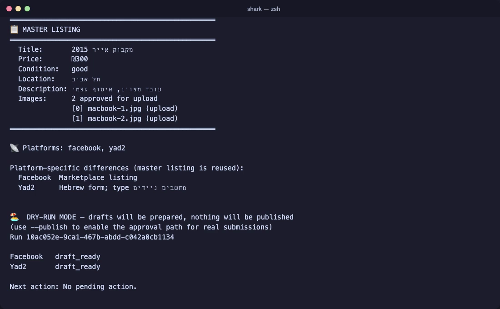

<div align="center">

# 🦈 Shark

**Sell once. Post everywhere.**
One CLI that fills your second-hand listing on **Facebook Marketplace (+ groups)**, **WhatsApp chats** and **Yad2** — from one shared, logged-in Chrome window, with a human approving every final click.

[](https://github.com/Doringber/theshark-/actions/workflows/verify.yml)
[](https://nodejs.org)
[](https://www.typescriptlang.org)
[](https://playwright.dev)
[](./LICENSE)
[](#claude-code-plugin)


<sub>Real session, real sites, nothing published: <code>doctor</code> → <code>sell … --non-interactive</code> → <code>draft_ready</code> on Facebook and Yad2.</sub>

</div>

---

## Why Shark

Selling a used MacBook in Israel means filling the same form three times: Facebook Marketplace (then ticking your groups), a photo + caption in a few WhatsApp chats, and Yad2's Hebrew form with its pick-from-list city/street/type fields. Shark does the typing. **You** keep the decisions:

|                                          |                                                                                                  |
| ---------------------------------------- | ------------------------------------------------------------------------------------------------ |
| 🏖️ **Dry-run by default**                | Every run prepares drafts. Publishing needs `--publish` _and_ a fresh "yes" per destination.     |
| 🪟 **One shared Chrome, logged in once** | Shark attaches over CDP to its own persistent Chrome (`~/.shark/chrome`). No throwaway browsers. |
| 🧾 **Never invents facts**               | Title, price, condition, location come from you. Missing? It asks — it never guesses a price.    |
| 🧩 **Never guesses selectors**           | Unknown page → `needs_mapping` + a sanitized DOM snapshot. No hallucinated clicks.               |
| 🛑 **Never bypasses a CAPTCHA or login** | Pauses in the same tab, waits for you, resumes. `shark resume <run-id>` if it exited first.      |
| 🔒 **Never logs secrets**                | No cookies, tokens, passwords, or image bytes in logs, run records or snapshots.                 |
| 🤖 **Agent-friendly**                    | Ships as a [Claude Code plugin](#claude-code-plugin); `--non-interactive` for scripted drafts.   |

## See it work

<table>
<tr>
<td width="50%" valign="top">

**Yad2 — real form, filled by Shark (`--draft-only`)**


Photos → title → type (autocomplete) → brand → description → condition → price → pickup address (city/street/house, all pick-from-list) → terms. Stops at **סיום והעלאה** and leaves the tab for you. Personal details are blurred in the recording.

</td>
<td width="50%" valign="top">

**Terminal — the run summary**



One master listing, per-platform differences spelled out, one status per destination. `published`, `draft_ready`, `skipped`, `needs_mapping`, `unknown_submission_state` mean exactly that.

</td>
</tr>
</table>

🎬 MP4s: [`shark-cli.mp4`](docs/media/shark-cli.mp4) · [`shark-yad2.mp4`](docs/media/shark-yad2.mp4) — more screens in [docs/UI.md](docs/UI.md).

## Quick start

```bash
git clone https://github.com/Doringber/theshark-.git && cd theshark-
npm install
cp shark.config.example.json shark.config.json   # pickup address, platforms, dryRun
npm run dev -- doctor                            # Node, Chrome, config, Shark Chrome

npm run dev -- browser                           # opens the shared Shark Chrome
npm run dev -- auth --platform facebook          # log in once per site, in that window
npm run dev -- auth --platform whatsapp
npm run dev -- auth --platform yad2

npm run dev -- sell ~/Desktop/macbook-photos     # interactive: asks only what it can't know
```

Or hand it everything up front (great for scripts and agents — still dry-run):

```bash
npm run dev -- sell --image front.jpg --image back.jpg \
  --title "מקבוק אייר 2015" --price 300 --condition good --location "תל אביב" \
  --description "עובד מצוין, איסוף עצמי" \
  --platforms facebook,whatsapp,yad2 \
  --groups "יד שנייה מודיעין" --wa-to "Family" \
  --yad2-type "מחשבים ניידים" --yad2-brand Apple \
  --non-interactive
```

Ready to go live? Add `--publish` (and `--no-dry-run` if your config forces dry-run). Shark will then ask, per destination, in the terminal:

```
Submit to facebook → marketplace?      (y/N)
Submit to facebook → יד שנייה מודיעין?  (y/N)
Submit to whatsapp → Family?           (y/N)
Submit to yad2 → yad2?                 (y/N)
```

There is no flag that answers those for you — by design.

## Commands

| Command                                  | What it does                                                   |
| ---------------------------------------- | -------------------------------------------------------------- |
| `shark sell [folder\|files] [--image …]` | Prepare drafts (dry-run). Interactive unless facts are flagged |
| `shark sell … --publish`                 | Unlock the approval path; each final click still asks          |
| `shark sell … --draft-only`              | Fill the form, leave the tab open, never submit                |
| `shark resume <run-id>`                  | Continue an interrupted run (CAPTCHA, closed terminal)         |
| `shark status <run-id>`                  | Per-platform status and the next human action                  |
| `shark browser [--url <url>]`            | Open / focus the shared Shark Chrome                           |
| `shark auth --platform <name>`           | Open that site's tab for a one-time login                      |
| `shark inspect --platform <name>`        | Save a sanitized DOM snapshot to `.shark/snapshots/`           |
| `shark doctor`                           | Environment check (Node, Chrome, CDP, config, open site tabs)  |
| `shark configure`                        | Remember language, city, pickup text, default platforms        |

### `sell` flags

| Flag                                                   | Meaning                                                                        |
| ------------------------------------------------------ | ------------------------------------------------------------------------------ |
| `--title --price --description --condition --location` | Listing facts. Condition: `new` `like_new` `good` `fair` `poor`                |
| `--platforms facebook,whatsapp,yad2`                   | Which platforms to run                                                         |
| `--category "Electronics"` `--groups "A,B"`            | Facebook category and groups (exact names) to cross-post to                    |
| `--wa-to "Chat 1,Group 2"`                             | WhatsApp chats/groups (exact names as shown in WhatsApp)                       |
| `--yad2-type "מחשבים ניידים"` `--yad2-brand Apple`     | Yad2 product type (their category name) and manufacturer                       |
| `--non-interactive`                                    | Skip the fact interview; requires all facts as flags. Approvals still prompt   |
| `--draft-only`                                         | Fill and stop; leave the tab open for review                                   |
| `--publish [--no-dry-run]`                             | Enable final prompts; every destination still needs its own fresh yes          |
| `--analysis-only 0,2`                                  | Mark image indices as analysis-only (never uploaded — e.g. serial-number shot) |
| `--cdp <url>`                                          | CDP endpoint (default `http://127.0.0.1:9333`; `none` = legacy own profile)    |

## The shared Shark Chrome

Shark never opens throwaway browsers. Every command attaches over CDP to a single **Shark Chrome** —
real Google Chrome, its own persistent profile at `~/.shark/chrome`, debug port `127.0.0.1:9333`.
Log in to Facebook, WhatsApp and Yad2 there **once**; every later run just opens a tab. Closed the
window? The next command relaunches it. Sign it into your Google account if you want your
bookmarks and passwords there.

Why not your everyday Chrome? Since Chrome 136 the browser refuses automation on the default
profile, and Chrome's own debugging port (9222) may already be taken by it — so Shark uses a
separate profile and a separate port, and fails with a clear message if another Chrome answers.

## Configuration

`shark.config.json` is git-ignored (it holds your pickup address). Start from the example:

```json
{
  "language": "he",
  "dryRun": true,
  "currency": "NIS",
  "seller": { "city": "תל אביב יפו", "street": "דיזנגוף", "houseNumber": "1" },
  "platforms": {
    "facebook": { "enabled": true, "url": "https://www.facebook.com" },
    "whatsapp": { "enabled": true, "url": "https://web.whatsapp.com" },
    "yad2": { "enabled": true, "url": "https://www.yad2.co.il" }
  }
}
```

Yad2 publishes only the city; street and house number stay in the pickup card.

## Claude Code plugin

The repo doubles as a Claude Code plugin (`.claude-plugin/plugin.json`). The `shark-sell` skill
carries the operating rules and site knowledge; `/shark-sell` and `/shark-browser` are slash
commands. The agent collects facts, runs the dry-run, shows you the per-destination plan — and
when you say go, it runs with `--publish` and **you** answer the final prompts in the terminal.

```
/plugin marketplace add /path/to/theshark-
/plugin install shark
```

## Platform notes (mapped against the live sites, Sep 2026)

**Facebook Marketplace** — `/marketplace/create/item` → photos, title, price, category (dialog),
condition, description → Next → destination step: Marketplace + your groups, Boost turned off →
Publish. Success = URL moves to `/marketplace/you` or "listing is live".

**WhatsApp Web** — reuses your single WhatsApp tab (WhatsApp allows one). Sidebar search →
exact chat name → Attach → "Photos & videos" → Hebrew caption → Send. Every chat is verified to
exist before anything is sent.

**Yad2** — `/publish-ad-products/create`, stable `data-testid`s. The "resume draft?" modal is
always answered with "התחלה מחדש" so an old draft never leaks in. hCaptcha ("Are you for real?")
pauses the run at `awaiting_human_captcha`; Shark waits in the same tab and never clicks it.

## Safety model

Full invariants live in [`AGENTS.md`](./AGENTS.md). In short:

- `--publish` enables the approval path; it is not approval. Every submit needs a fresh in-memory
  token bound to `(runId, listingId, platform, destination)` with a short TTL — never persisted,
  never reused.
- If a final click may have happened but success is uncertain → `unknown_submission_state`, no
  automatic retry, ever.
- Images marked `analysis_only` / `replace_required` are never uploaded; only the exact approved,
  ordered set is.
- No selector guessing: unknown UI → `needs_mapping`, browser left open for inspection.

## Architecture

```
src/
├── cli.ts                          # Commander entry point
├── domain/                         # Zod schemas: Listing, ProductImage, SharkConfig, workflow states
├── services/                       # approvals (in-memory tokens), run-store, redaction, image sources
├── browser/
│   ├── session.ts                  # Attaches to Shark Chrome over CDP; launches it if needed
│   ├── challenge-detector.ts       # CAPTCHA / checkpoint detection (never solves)
│   ├── page-identity.ts            # "Is this the page we mapped?" before acting
│   └── snapshot.ts                 # Sanitized accessibility-tree capture
├── orchestration/
│   └── sell-orchestrator.ts        # Checkpointed per-destination flow, resume, idempotency keys
└── platforms/
    ├── facebook-marketplace.ts     # + groups, Boost off
    ├── whatsapp-web.ts             # single-tab reuse, per-chat approval
    └── yad2.ts                     # Hebrew form, autocompletes, contact modal
```

## Development

```bash
npm run dev -- <cmd>      # run via tsx
npm run typecheck         # tsc --noEmit
npm run lint              # ESLint
npm run format:check      # Prettier
npm test                  # Vitest (unit)
npm run test:integration  # Playwright against local HTML fixtures (localhost:4173)
```

Tests are the contract: safety tests are written first and never weakened to make code pass.
Fixture tests never touch real platforms; there are no automated live-publish tests.
CI runs format, lint, typecheck, build, unit and integration on every push and PR.

## Contributing & roadmap

Issues and PRs welcome — especially new adapter mappings (a `shark inspect` snapshot attached to
the issue is the fastest way to get a selector fixed). Ideas on the table: more marketplaces,
listing templates, and a small local web UI for the review step.

If Shark saved you an evening of copy-paste, a ⭐ helps others find it.

<div align="center"><sub>Built in Israel 🇮🇱 · MIT</sub></div>
