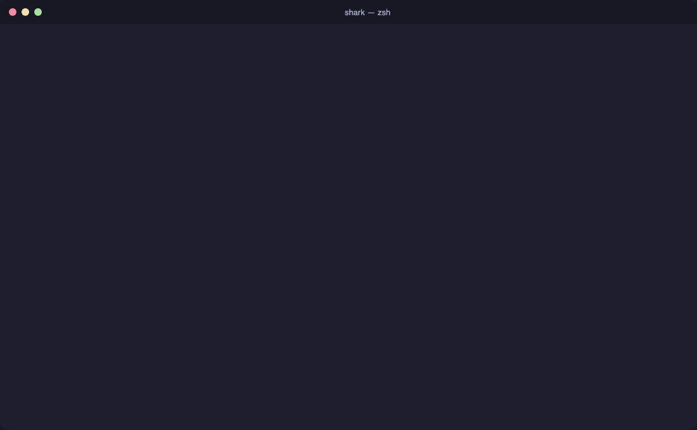
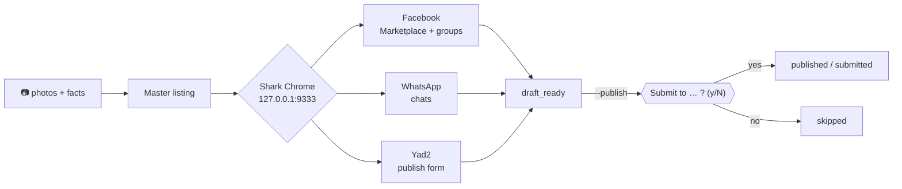

<div align="center">

<picture>
  <source media="(prefers-color-scheme: dark)" srcset="docs/assets/shark-logo-dark.svg">
  
</picture>

<h3>Sell once. Post everywhere — with a human on the final click.</h3>

[](https://github.com/Doringber/theshark-/actions/workflows/verify.yml)
[](https://nodejs.org)
[](https://www.typescriptlang.org)
[](https://playwright.dev)
[](#-claude-code-plugin)
[](LICENSE)

English | [עברית](#-בעברית-בקצרה)

<div align="left">

Shark is a local CLI that takes one second-hand listing — photos, title, price, condition — and
fills the real forms on **Facebook Marketplace (+ your groups)**, **WhatsApp chats** and **Yad2**
through a single, persistently logged-in Chrome window. It is dry-run by default, never invents a
fact or a selector, never bypasses a CAPTCHA, and asks you for a fresh yes before every Publish
or Send.

</div>

**🚀 [Quick start](#-installation) |
📸 [UI walkthrough](docs/UI.md) |
🧪 [Examples](#-examples) |
🤖 [Claude Code plugin](#-claude-code-plugin) |
🛡️ [Safety invariants](AGENTS.md)**



<sub>Real session, real sites, nothing published.</sub>

</div>

## 🎯 When to use Shark

| You want to…                                                  | Run                                     | You still do                               |
| ------------------------------------------------------------- | --------------------------------------- | ------------------------------------------ |
| See exactly what would be posted, everywhere, without posting | `shark sell …` (dry-run is the default) | Nothing — read the drafts                  |
| Fill a form completely and finish it yourself                 | `shark sell … --draft-only`             | Press Publish in the open tab              |
| Publish for real, one destination at a time                   | `shark sell … --publish`                | Answer `Submit to … ?` per destination     |
| Let Codex prepare a safe listing preview                      | [`$shark-sell`](.agents/skills/shark-sell/SKILL.md) | Review facts, photos, and destinations     |
| Let Claude Code prepare the listing from a chat               | `/shark-sell`                           | Approve the plan, answer the final prompts |
| Pick up after a CAPTCHA, a login, or a closed terminal        | `shark resume <run-id>`                 | Solve the check in the Shark Chrome tab    |

## 🧩 How Shark compares

| Ability                                              | Copy-paste by hand | Generic "auto-poster" bot | **Shark** |
| ---------------------------------------------------- | :----------------: | :-----------------------: | :-------: |
| Fills Facebook Marketplace + groups, WhatsApp, Yad2  |         ✅         |             ~             |    ✅     |
| Uses your existing logins (no password handling)     |         ✅         |            ❌             |    ✅     |
| Dry-run first, publish only on explicit approval     |         —          |            ❌             |    ✅     |
| Refuses to guess price / condition / selectors       |         ✅         |            ❌             |    ✅     |
| Stops at CAPTCHA / login and resumes from checkpoint |         —          |            ❌             |    ✅     |
| Excludes photos with serial numbers / IDs            |   if you notice    |            ❌             |    ✅     |
| Drivable by an AI agent (Claude Code plugin)         |         ❌         |            ❌             |    ✅     |

## 🔄 How it works



| Step | What happens                                                                                        | Where it lives                                                |
| ---- | --------------------------------------------------------------------------------------------------- | ------------------------------------------------------------- |
| 1    | Photos are validated; any image you mark `analysis_only` is never uploaded                          | `services/image-sources.ts`, `domain/schemas.ts`              |
| 2    | Facts come from flags or a short interview — Shark never fills a gap with a guess                   | `commands/sell.ts`, `services/listing-interview.ts`           |
| 3    | Shark attaches over CDP to the shared **Shark Chrome** (own profile, logged in once)                | `browser/session.ts`                                          |
| 4    | Each adapter verifies login and page identity, then fills the form — unknown UI → `needs_mapping`   | `platforms/*.ts`, `browser/page-identity.ts`                  |
| 5    | Per destination: `draft_ready`; with `--publish`, a fresh in-memory approval token gates the click  | `orchestration/sell-orchestrator.ts`, `services/approvals.ts` |
| 6    | Every step is checkpointed with an idempotency key; CAPTCHA/login → pause, `shark resume` continues | `services/run-store.ts`, `browser/challenge-detector.ts`      |

## 📦 Installation

Requirements: macOS, Node.js 20+, Google Chrome.

```bash
git clone https://github.com/Doringber/theshark-.git && cd theshark-
npm install
cp shark.config.example.json shark.config.json   # pickup address, platforms, dryRun
npm run dev -- doctor
```

```
🦈 Shark Doctor
  ✅ Node.js: v26.8.2
  ✅ Playwright: Version 1.63.0
  ✅ Config: shark.config.json — platforms: facebook, whatsapp, yad2
  ✅ Google Chrome: /Applications/Google Chrome.app/Contents/MacOS/Google Chrome
  ✅ Shark Chrome: running (http://127.0.0.1:9333), profile ~/.shark/chrome
  ✅ Open site tabs: facebook.com, web.whatsapp.com, yad2.co.il
🦈 All checks passed — ready to sell!
```

Log in once, in the Shark Chrome window (Shark never sees or stores passwords):

```bash
npm run dev -- browser                       # opens / focuses the shared window
npm run dev -- auth --platform facebook
npm run dev -- auth --platform whatsapp      # scan the QR in that tab
npm run dev -- auth --platform yad2
```

> **Why a separate Chrome?** Since Chrome 136 the browser refuses automation on your default
> profile, and its own debugging port (9222) is often already taken by it. Shark Chrome is real
> Google Chrome with its own profile at `~/.shark/chrome` on port `9333`. Sign it into your Google
> account if you want your bookmarks and passwords there.

## 🧪 Examples

All examples use the same two photos and the same facts. Every command below is **dry-run** unless
it says `--publish`. Outputs are from real runs (Sep 2026).

### Facebook Marketplace + groups

```bash
npm run dev -- sell --image photos/macbook-1.jpg --image photos/macbook-2.jpg \
  --title "מקבוק אייר 2015 13 אינץ'" --price 300 --condition good \
  --location "מודיעין מכבים רעות" --description "עובד מצוין, סוללה במצב טוב. איסוף עצמי." \
  --platforms facebook --category "Electronics" \
  --groups "יד שנייה מודיעין,Modiin Buy & Sell" \
  --non-interactive
```

What Shark does on `/marketplace/create/item`: photos → title → price → location → category
dialog → condition → description ("More details" expanded if collapsed) → **Next** → destination
step: Marketplace **plus each group you named**, "Boost listing" switched off → stops.

```
Facebook   draft_ready — Draft prepared — no final action

Next action: No pending action.
```

Publish for real — one question per destination:

```bash
npm run dev -- sell … --platforms facebook --groups "יד שנייה מודיעין" --publish --non-interactive
```

```
⚡ PUBLISH MODE — submissions will be attempted
⚠️  You are about to publish to real platforms. Are you sure? (y/N) y
Submit to facebook → marketplace? (y/N) y
Submit to facebook → יד שנייה מודיעין? (y/N) y

Facebook   published
```

A group that doesn't exist on the destination screen is reported as `needs_mapping`, not silently
dropped. Success is verified by the URL moving to `/marketplace/you` or the "listing is live" text;
anything else is `unknown_submission_state` and is **never retried automatically**.

### WhatsApp chats and groups

```bash
npm run dev -- sell --image photos/macbook-1.jpg --image photos/macbook-2.jpg \
  --title "מקבוק אייר 2015 13 אינץ'" --price 300 --condition good \
  --location "מודיעין מכבים רעות" --description "עובד מצוין, סוללה במצב טוב. איסוף עצמי." \
  --platforms whatsapp --wa-to "Family,יד שנייה מודיעין" \
  --non-interactive
```

Shark reuses your **existing WhatsApp tab** (WhatsApp allows only one), searches the sidebar for
each exact chat name, and verifies it exists. Dry-run stops there:

```
WhatsApp   draft_ready — Draft prepared — no final action
```

With `--publish`, each chat is a separate approval; a "yes" sends the photos with this caption:

```
למכירה: מקבוק אייר 2015 13 אינץ'
מחיר: ₪300
איסוף: מודיעין מכבים רעות

עובד מצוין, סוללה במצב טוב. איסוף עצמי.
```

```
Submit to whatsapp → Family? (y/N) y
Submit to whatsapp → יד שנייה מודיעין? (y/N) n

WhatsApp   submitted to 1 approved group
```

If the tab shows the QR code, the run pauses at `awaiting_login`; scan it in Shark Chrome and
`shark resume <run-id>`.

### Yad2

```bash
npm run dev -- sell --image photos/macbook-1.jpg --image photos/macbook-2.jpg \
  --title "מקבוק אייר 2015 13 אינץ'" --price 300 --condition good \
  --location "מודיעין מכבים רעות" --description "עובד מצוין, סוללה במצב טוב. איסוף עצמי." \
  --platforms yad2 --yad2-type "מחשבים ניידים" --yad2-brand Apple \
  --draft-only --non-interactive
```


On `/publish-ad-products/create`: the "resume draft?" modal is always answered **התחלה מחדש** →
photos → title → type (autocomplete, Yad2's own category name) → brand → description → condition
toggle → price → contact card: city / street / house number from `shark.config.json` → terms
checkbox. `--draft-only` leaves the tab on **סיום והעלאה** for you:

```
Yad2       draft_ready

Next action: No pending action.
```

If Yad2 shows its hCaptcha ("Are you for real?"), Shark waits in the same tab:

```
Yad2       awaiting_human_captcha

Next action: Complete the Yad2 CAPTCHA in Shark Chrome, then run shark resume 32aa036d-….
```

### All three at once

```bash
npm run dev -- sell photos/ \
  --title "מקבוק אייר 2015 13 אינץ'" --price 300 --condition good \
  --location "מודיעין מכבים רעות" --description "עובד מצוין, סוללה במצב טוב. איסוף עצמי." \
  --platforms facebook,whatsapp,yad2 \
  --category "Electronics" --groups "יד שנייה מודיעין" \
  --wa-to "Family" \
  --yad2-type "מחשבים ניידים" --yad2-brand Apple \
  --non-interactive
```

```
══════════════════════════════════════════════════
📋 MASTER LISTING
══════════════════════════════════════════════════
  Title:       מקבוק אייר 2015 13 אינץ'
  Price:       ₪300
  Condition:   good
  Location:    מודיעין מכבים רעות
  Description: עובד מצוין, סוללה במצב טוב. איסוף עצמי.
  Images:      2 approved for upload
══════════════════════════════════════════════════
📡 Platforms: facebook, whatsapp, yad2

Platform-specific differences (master listing is reused):
  Facebook  Marketplace listing; category Electronics
  WhatsApp  Hebrew caption to Family
  Yad2      Hebrew form; type מחשבים ניידים; brand Apple

🏖️  DRY-RUN MODE — drafts will be prepared, nothing will be published
Run b335bee0-d1e6-46ca-9afa-0a06bf6269c2

Facebook   draft_ready
WhatsApp   draft_ready
Yad2       draft_ready

Next action: No pending action.
```

### Interactive (no flags)

```bash
npm run dev -- sell ~/Desktop/macbook-photos
```

Shark asks only what it cannot know — title, price, condition, city, defects, pickup — shows the
master listing, lets you edit a field or exclude a photo, then asks which platforms.

### A photo with a serial number

```bash
npm run dev -- sell --image front.jpg --image back.jpg --image sticker.jpg --analysis-only 2 …
```

Image `[2]` is marked `analysis_only`: it is never uploaded anywhere, and any identifier on it is
never reproduced in copy, logs or snapshots.

### Let an LLM write the description (from your facts only)

```bash
export OPENAI_API_KEY=…        # or ANTHROPIC_API_KEY / GEMINI_API_KEY / CODEX_API_KEY
npm run dev -- sell photos/ --title "מקבוק אייר 2015 13 אינץ'" --price 300 --condition good \
  --location "מודיעין" --defects "שריטה קלה במכסה" --platforms yad2 \
  --llm openai --llm-model gpt-4o-mini --non-interactive
```

```
✍️  Description written by openai/gpt-4o-mini from your facts only
  Description: למכירה מקבוק אייר 2015 13 אינץ' במצב טוב. שריטה קלה במכסה. 300 ש"ח, איסוף עצמי במודיעין.
```

| Provider                              | `--llm`     | Key (env only)                                                  | Default model             |
| ------------------------------------- | ----------- | --------------------------------------------------------------- | ------------------------- |
| OpenAI                                | `openai`    | `OPENAI_API_KEY`                                                | `gpt-4o-mini`             |
| Codex / any OpenAI-compatible gateway | `codex`     | `CODEX_API_KEY` or `OPENAI_API_KEY` (+ `llm.baseUrl` in config) | `gpt-4o-mini`             |
| Anthropic                             | `anthropic` | `ANTHROPIC_API_KEY`                                             | `claude-3-5-haiku-latest` |
| Google                                | `gemini`    | `GEMINI_API_KEY` / `GOOGLE_API_KEY`                             | `gemini-2.0-flash`        |

The model gets **only** the facts you typed (title, price, condition, defects, city, pickup, your
notes) — never image bytes or paths — and is told not to add anything. A **fact guard** then
rejects the output if it contains any number that wasn't in your facts (a different price, an
invented year, "16GB"), or anything that looks like a serial number; in that case your own text is
kept and the reason is printed. Keys are never written to config, logs or run records. Interactive
mode: choose **Regenerate** to get a new draft.

### Interrupted? Resume

```bash
npm run dev -- status 32aa036d-3345-4808-a91d-1a053d004af4
npm run dev -- resume 32aa036d-3345-4808-a91d-1a053d004af4
```

Resume continues from the last checkpoint. Nothing that was already submitted is submitted twice
(idempotency keys per destination), and nothing pending is submitted without asking you again.

## 🤖 Claude Code plugin

The repo doubles as a Claude Code plugin (`.claude-plugin/plugin.json`). The `shark-sell` skill
carries the operating rules and live-site knowledge; `/shark-sell` and `/shark-browser` are slash
commands.

```
/plugin marketplace add /path/to/theshark-
/plugin install shark
```

```
/shark-sell ~/Desktop/macbook-photos  מקבוק אייר 2015  300
```

The agent collects the facts, runs the dry-run, shows the per-destination plan, and — when you say
go — runs with `--publish`. **The `Submit to … ?` prompts are still answered by you in the
terminal.** There is deliberately no flag that answers them.

## 📐 Architecture

```
src/
├── cli.ts                          # Commander entry point
├── domain/                         # Zod schemas: Listing, ProductImage, SharkConfig, workflow states
├── services/                       # approvals (in-memory tokens), run-store, redaction, image sources
├── browser/
│   ├── session.ts                  # Attaches to Shark Chrome over CDP (127.0.0.1:9333); launches it if needed
│   ├── challenge-detector.ts       # CAPTCHA / checkpoint detection — never solves
│   ├── page-identity.ts            # "Is this the page we mapped?" before acting
│   └── snapshot.ts                 # Sanitized accessibility-tree capture
├── orchestration/
│   └── sell-orchestrator.ts        # Checkpointed per-destination flow, resume, idempotency keys
└── platforms/
    ├── facebook-marketplace.ts     # + groups, Boost off
    ├── whatsapp-web.ts             # single-tab reuse, per-chat approval
    └── yad2.ts                     # Hebrew form, autocompletes, contact modal
```

Configuration (`shark.config.json`, git-ignored):

```json
{
  "language": "he",
  "dryRun": true,
  "currency": "NIS",
  "seller": { "city": "תל אביב יפו", "street": "דיזנגוף", "houseNumber": "1" },
  "llm": { "provider": "openai", "model": "gpt-4o-mini" },
  "platforms": {
    "facebook": { "enabled": true, "url": "https://www.facebook.com" },
    "whatsapp": { "enabled": true, "url": "https://web.whatsapp.com" },
    "yad2": { "enabled": true, "url": "https://www.yad2.co.il" }
  }
}
```

## 🛡️ Safety model

The full list is in [`AGENTS.md`](AGENTS.md) and is enforced by tests that are never weakened.

- **Dry-run is the default.** `--publish` enables the approval path; it is not approval.
- **One fresh approval per destination**, bound to `(runId, listingId, platform, destination)` with
  a short TTL — never persisted, reused, or shared.
- **Uncertain click → `unknown_submission_state`**, never an automatic retry.
- **No credential handling.** Passwords, cookies, tokens, request headers and image bytes are
  never logged or stored.
- **No selector guessing.** Unknown UI → `needs_mapping` + sanitized snapshot in `.shark/snapshots/`.
- **No CAPTCHA / 2FA / rate-limit bypass**, ever.

## 📖 Learn more

- [docs/UI.md](docs/UI.md) — every screen, with recordings
- [AGENTS.md](AGENTS.md) — engineering invariants
- [skills/shark-sell/SKILL.md](skills/shark-sell/SKILL.md) — what the agent knows about each site
- [shark.config.example.json](shark.config.example.json)

### Development

```bash
npm run dev -- <cmd>       npm run typecheck        npm run lint
npm run format:check       npm test                 npm run test:integration
```

Unit tests: Vitest. Integration: Playwright against local HTML fixtures (`localhost:4173`) — no
real platform is touched and there are no automated live-publish tests. CI runs everything on
every push and PR.

## 🤝 Community & contributing

Issues and PRs welcome. The fastest way to get a selector fixed after a site change is to attach
the output of `shark inspect --platform <name>` (it is sanitized) to the issue. On the table:
more marketplaces, listing templates, a small local web UI for the review step.

If Shark saved you an evening of copy-paste, a ⭐ helps others find it.

## ⭐ Star history

<a href="https://star-history.com/#Doringber/theshark-&Date">
  
</a>

## 🇮🇱 בעברית, בקצרה

Shark הוא כלי שורת-פקודה שממלא בשבילך מודעת יד-שנייה אחת ב-**פייסבוק מרקטפלייס (+קבוצות)**,
ב-**וואטסאפ** וב-**יד2**, דרך חלון כרום אחד שמחובר לחשבונות שלך. כברירת מחדל הוא רק מכין
טיוטות; הוא לא ממציא מחיר או מצב, לא עוקף קאפצ'ה, ולפני כל פרסום או שליחה — שואל אותך.

```bash
npm run dev -- sell ~/Desktop/photos --platforms facebook,whatsapp,yad2
```

<div align="center"><sub>MIT · Built in Israel</sub></div>
