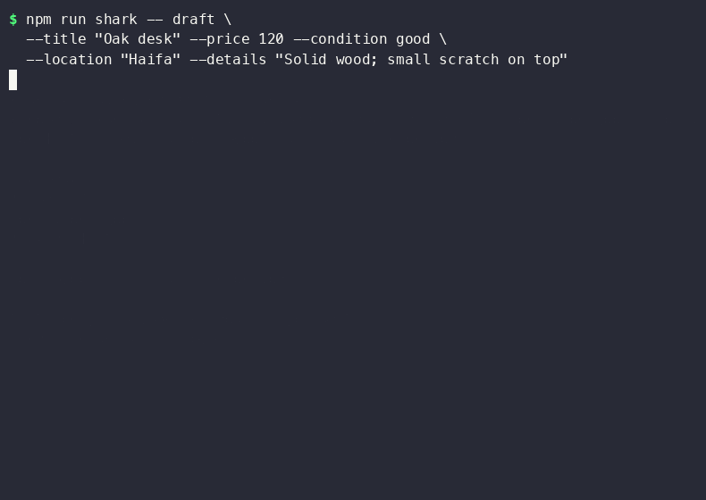
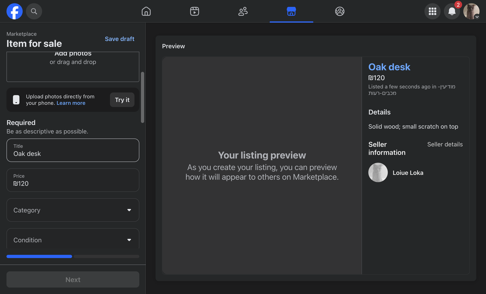
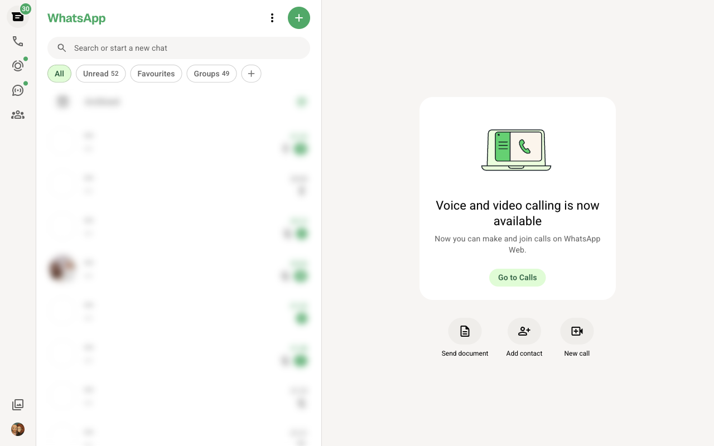
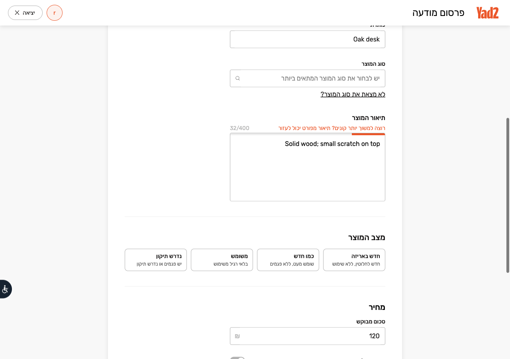
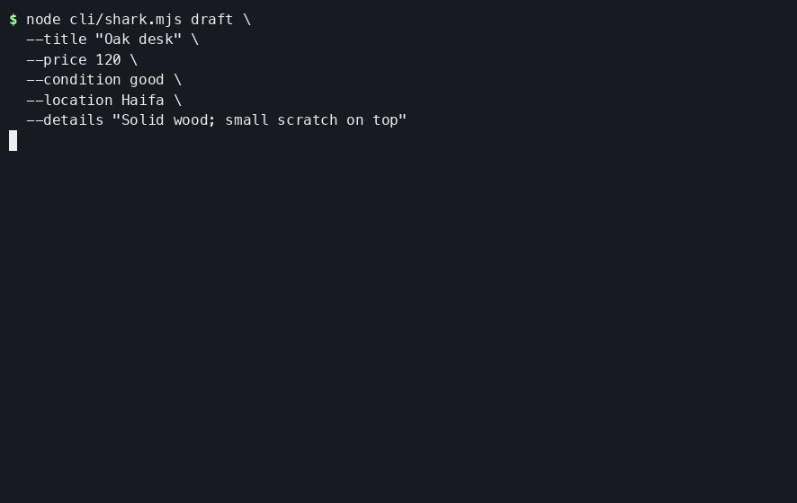

# Shark

Shark is an AI skill and a small CLI for selling second-hand items. The skill gathers item facts, writes listing copy, and fills marketplace forms in **Shark Chrome** (one manual login per site, session reused from `~/.shark/chrome`). Neither invents missing product facts.

Shark works with Facebook Marketplace and Yad2. For WhatsApp, choose the exact group, chat, or status audience. Dry-run is the default: `fill` stops before Publish/Post. To request a submission, include `--publish` in the skill flow and approve the exact destination immediately before each final action.

### End-to-end: Facebook, WhatsApp, and Yad2

One shared Shark Chrome profile (`~/.shark/chrome`). Log in manually once per site with `auth`, then reuse the session.

```text
draft  →  browser  →  check (×3)  →  fill facebook  →  fill whatsapp  →  fill yad2
                              ↓              ↓                  ↓               ↓
                         logged_in?     form_filled      compose_ready    form_filled
                                        (no Publish)      (no Send)       (no Post)
```



<video src="assets/shark-browser.mp4" controls width="720">
  Terminal recording: <a href="assets/shark-browser.mp4">shark-browser.mp4</a>
</video>

Browser tabs after the same run (dry-run — nothing published or sent):

| Facebook Marketplace | WhatsApp Web | Yad2 |
|---------------------|--------------|------|
|  |  |  |

WhatsApp: pass `--wa-to "Exact chat name"` to paste the draft into that chat’s composer (same text as `buildWhatsAppMessage` — למכירה, מחיר, איסוף). Demo screenshots require `SHARK_DEMO_WA_TO` when re-capturing; the sidebar is blurred and the header shows a generic label.

Quick draft-only demo (no browser):



## Sell directly from ChatGPT Work

Use the installed `shark-sell` skill and provide the item facts, ordered photos, and destinations in this chat. The repo skill supports the hosted browser directly; the local CLI is optional. If the skill is already installed, read its current instructions before using it. A GitHub connection alone does not install the skill or authenticate marketplace accounts.

Example request:

> Use Shark to sell my desk. Price: ₪120. Condition: good. Pickup: Haifa. Details: small scratch on top. Use these attached photos in order. Prepare Facebook Marketplace and Yad2 drafts, and a WhatsApp draft in the exact group “My selling group”.

Shark reviews the copy with you, opens each requested site, resolves sign-in using the host's secure authentication flow, fills fields from the live page, uploads only approved photos through supported host upload controls, and reads back the result. If upload or sign-in is unavailable, it reports the blocker and preserves useful work. It stops before publishing or sending. Requesting submission with `--publish` still requires fresh approval of each destination, exact text, and ordered photos.

| Backend | Form support | Photos | Authentication |
| --- | --- | --- | --- |
| ChatGPT Work browser + skill | Live page inspection; site-specific required fields | Approved photos through the host upload flow, if available | Secure host sign-in / documented handoff per site |
| Local CLI + Shark Chrome | A subset of fields; read-back verification and `partial_fill` for gaps | No photo-upload CLI option | Manual login in Shark Chrome |

The CLI reports `verifiedFields` and `missingFields` for marketplace fills. `partial_fill`, `needs_mapping`, or `blocked` exits with code 3; login-required exits with code 2. Category, condition, location selection, and photos still require host-browser or manual completion. Yad2 existing drafts are preserved until you choose how to proceed. Demo images illustrate an earlier run and do not prove current site compatibility.

## Use the CLI

Requires Node.js 20 or newer. Run `npm install` once for browser attach (`playwright-core`). Google Chrome must be installed for `browser` / `fill`.

```bash
node cli/shark.mjs draft \
  --title "Oak desk" \
  --price 120 \
  --condition good \
  --location "Haifa" \
  --details "Solid wood; small scratch on top"
```

The `draft` command prints plain text only. Optional browser commands open **Shark Chrome** (profile `~/.shark/chrome`) so you log in once per site and later commands reuse that session. `fill` stops before Publish/Post.

```bash
npm install   # playwright-core for browser attach
npm run shark -- browser
npm run shark -- auth --platform facebook   # once per site
npm run shark -- auth --platform whatsapp
npm run shark -- auth --platform yad2
npm run shark -- check --platform facebook
npm run shark -- fill --platform facebook \
  --title "Oak desk" --price 120 --condition good \
  --location "Haifa" --details "Solid wood; small scratch on top"
npm run shark -- fill --platform whatsapp --wa-to "My selling group" \
  --title "Oak desk" --price 120 --condition good \
  --details "Solid wood; small scratch on top"
npm run shark -- fill --platform yad2 \
  --title "Oak desk" --price 120 --condition good \
  --location "Haifa" --details "Solid wood; small scratch on top"
```

### Connect your browser session

Run these commands on the computer where Google Chrome is installed. `browser` starts a separate Shark Chrome profile; `auth` opens the selected site in that same profile. Complete login or scan the WhatsApp QR code in the open Chrome window, then run `check` to confirm the session before `fill`.

```bash
npm run shark -- browser
npm run shark -- auth --platform whatsapp
# Scan the QR code in the Shark Chrome window with your phone.
npm run shark -- check --platform whatsapp
```

For a Chrome instance that already exposes a CDP endpoint to this computer, pass its URL to every command or set `SHARK_CDP_URL`. `browser` will connect to that endpoint without starting another Chrome profile. Keep the CDP endpoint private; it grants control over that browser and its signed-in sessions.

```bash
npm run shark -- browser --cdp http://127.0.0.1:9333
npm run shark -- auth --platform facebook --cdp http://127.0.0.1:9333
npm run shark -- check --platform facebook --cdp http://127.0.0.1:9333
```

The local CLI connects only to Shark Chrome or an explicitly supplied reachable CDP endpoint. ChatGPT Work uses its own documented browser controls directly through the skill; no CDP endpoint or local Chrome is needed. Sessions are separate, so logging in to GitHub or local Chrome does not log in to marketplaces in the hosted browser.

Required facts for `draft` / `fill`: title, price, and condition (`new`, `like_new`, `good`, `fair`, or `poor`). Location and details are optional.

## Use the skill with an AI assistant

Clone this repo and open its folder in your assistant. Node.js 20+ is needed only if you also want to run the CLI. The skill file is [`skills/shark-sell/SKILL.md`](skills/shark-sell/SKILL.md); copy it to the project skill folder for the assistant you use.

### Claude Code

From the repo root, install the project skill and start Claude Code:

```bash
mkdir -p .claude/skills/shark-sell
cp skills/shark-sell/SKILL.md .claude/skills/shark-sell/SKILL.md
claude .
```

Ask Shark to prepare a listing or invoke `/shark-sell` in Claude Code. Give it the item facts and target marketplaces. When browser controls are available, it can fill the forms and leave them ready for your review. Project skills live under `.claude/skills/`. See the [Claude Code skills guide](https://code.claude.com/docs/en/skills).

### Codex

From the repo root, install the skill where Codex looks for project skills:

```bash
mkdir -p .agents/skills/shark-sell
cp skills/shark-sell/SKILL.md .agents/skills/shark-sell/SKILL.md
```

Open the repo in Codex, then type `$shark-sell` and provide the item facts and target marketplaces. If browser controls are available, Shark can fill the forms and leave them ready for review. If the skill does not appear, restart Codex. See the [Codex skills guide](https://developers.openai.com/codex/skills).

### VS Code with GitHub Copilot

From the repo root, install the skill in VS Code's supported project skills folder:

```bash
mkdir -p .github/skills/shark-sell
cp skills/shark-sell/SKILL.md .github/skills/shark-sell/SKILL.md
```

Open the repo in VS Code, open Copilot Chat, and type `/shark-sell` or ask for a listing with the item facts and target marketplaces. Form filling depends on browser controls being available to the assistant; otherwise Shark prepares copy for you to paste. VS Code also recognizes `.agents/skills/`. See [Use Agent Skills in VS Code](https://code.visualstudio.com/docs/agent-customization/agent-skills).

### Try it

From the repo root, run the CLI with the item facts to create a local draft:

```bash
npm run shark -- draft \
  --title "Oak desk" \
  --price 120 \
  --condition good \
  --location "Haifa" \
  --details "Solid wood; small scratch on top"
```

The CLI prints a local text draft. To use the full skill workflow, invoke `$shark-sell` in Codex (or the equivalent skill command in your assistant), provide item facts and destinations, and review the filled forms. Add `--publish` only when you intend to submit; Shark will still ask you to approve the exact destination and content immediately before each post or send.

## Development

```bash
npm test
```

The tests run locally with Node's built in test runner.

### Re-record the browser demo

With Shark Chrome logged in to Facebook, WhatsApp, and Yad2:

```bash
sh assets/record-demo-browser.sh          # smoke run (all three platforms)
# Optional: paste draft into a real chat for the WhatsApp screenshot
export SHARK_DEMO_WA_TO="Exact WhatsApp sidebar title (e.g. your selling group)"
asciinema rec -c "sh assets/record-demo-browser.sh" --overwrite assets/shark-browser.cast
agg assets/shark-browser.cast assets/shark-browser.gif
ffmpeg -i assets/shark-browser.gif -movflags faststart -pix_fmt yuv420p assets/shark-browser.mp4
node assets/capture-e2e-screenshots.mjs   # shark-browser-{facebook,whatsapp,yad2}.png
```

## License

MIT. See [LICENSE](LICENSE).
