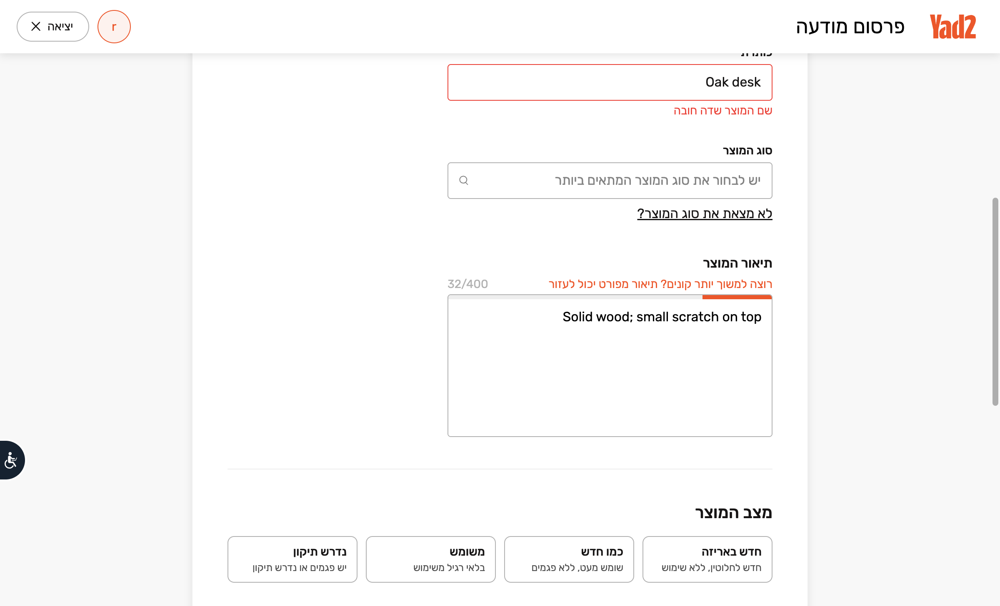

# Shark

Shark is an AI skill and a small CLI for selling second-hand items. The skill gathers item facts, writes listing copy, and fills marketplace forms in **Shark Chrome** (one manual login per site, session reused from `~/.shark/chrome`). Neither invents missing product facts.

Shark works with Facebook Marketplace and Yad2. For WhatsApp, choose the exact group, chat, or status audience. Dry-run is the default: `fill` stops before Publish/Post. To request a submission, include `--publish` in the skill flow and approve the exact destination immediately before each final action.

### Browser workflow (terminal + live form)


<video src="assets/shark-browser.mp4" controls width="720">
  Terminal recording: <a href="assets/shark-browser.mp4">shark-browser.mp4</a>
</video>

Filled listing form in Shark Chrome (same run; stops before publish):



Quick draft-only demo (no browser):


## Use the CLI

Requires Node.js 20 or newer. Run `npm install` once for browser attach (`playwright-core`). Google Chrome must be installed for `browser` / `fill`.

```bash
node cli/shark.mjs draft \
  --title "Oak desk" \
  --price 120 \
  --condition good \
  --location "Haifa" \
  --details "Solid wood; small scratch on top"
```

The `draft` command prints plain text only. Optional browser commands open **Shark Chrome** (profile `~/.shark/chrome`) so you log in once per site and later commands reuse that session. `fill` stops before Publish/Post.

```bash
npm install   # playwright-core for browser attach
npm run shark -- browser
npm run shark -- auth --platform yad2
npm run shark -- fill --platform facebook \
  --title "Oak desk" --price 120 --condition good \
  --location "Haifa" --details "Solid wood; small scratch on top"
```

Required facts for `draft` / `fill`: title, price, and condition (`new`, `like_new`, `good`, `fair`, or `poor`). Location and details are optional.

## Use the skill with an AI assistant

Clone this repo and open its folder in your assistant. Node.js 20+ is needed only if you also want to run the CLI. The skill file is [`skills/shark-sell/SKILL.md`](skills/shark-sell/SKILL.md); copy it to the project skill folder for the assistant you use.

### Claude Code

From the repo root, install the project skill and start Claude Code:

```bash
mkdir -p .claude/skills/shark-sell
cp skills/shark-sell/SKILL.md .claude/skills/shark-sell/SKILL.md
claude .
```

Ask Shark to prepare a listing or invoke `/shark-sell` in Claude Code. Give it the item facts and target marketplaces. When browser controls are available, it can fill the forms and leave them ready for your review. Project skills live under `.claude/skills/`. See the [Claude Code skills guide](https://code.claude.com/docs/en/skills).

### Codex

From the repo root, install the skill where Codex looks for project skills:

```bash
mkdir -p .agents/skills/shark-sell
cp skills/shark-sell/SKILL.md .agents/skills/shark-sell/SKILL.md
```

Open the repo in Codex, then type `$shark-sell` and provide the item facts and target marketplaces. If browser controls are available, Shark can fill the forms and leave them ready for review. If the skill does not appear, restart Codex. See the [Codex skills guide](https://developers.openai.com/codex/skills).

### VS Code with GitHub Copilot

From the repo root, install the skill in VS Code's supported project skills folder:

```bash
mkdir -p .github/skills/shark-sell
cp skills/shark-sell/SKILL.md .github/skills/shark-sell/SKILL.md
```

Open the repo in VS Code, open Copilot Chat, and type `/shark-sell` or ask for a listing with the item facts and target marketplaces. Form filling depends on browser controls being available to the assistant; otherwise Shark prepares copy for you to paste. VS Code also recognizes `.agents/skills/`. See [Use Agent Skills in VS Code](https://code.visualstudio.com/docs/agent-customization/agent-skills).

### Try it

From the repo root, run the CLI with the item facts to create a local draft:

```bash
npm run shark -- draft \
  --title "Oak desk" \
  --price 120 \
  --condition good \
  --location "Haifa" \
  --details "Solid wood; small scratch on top"
```

The CLI prints a local text draft. To use the full skill workflow, invoke `$shark-sell` in Codex (or the equivalent skill command in your assistant), provide item facts and destinations, and review the filled forms. Add `--publish` only when you intend to submit; Shark will still ask you to approve the exact destination and content immediately before each post or send.

## Development

```bash
npm test
```

The tests run locally with Node's built in test runner.

### Re-record the browser demo

With Shark Chrome already logged in to Yad2 (or edit `record-demo-browser.sh` for another platform):

```bash
sh assets/record-demo-browser.sh          # smoke run
asciinema rec -c "sh assets/record-demo-browser.sh" --overwrite assets/shark-browser.cast
agg assets/shark-browser.cast assets/shark-browser.gif
ffmpeg -i assets/shark-browser.gif -movflags faststart -pix_fmt yuv420p assets/shark-browser.mp4
```

## License

MIT. See [LICENSE](LICENSE).
