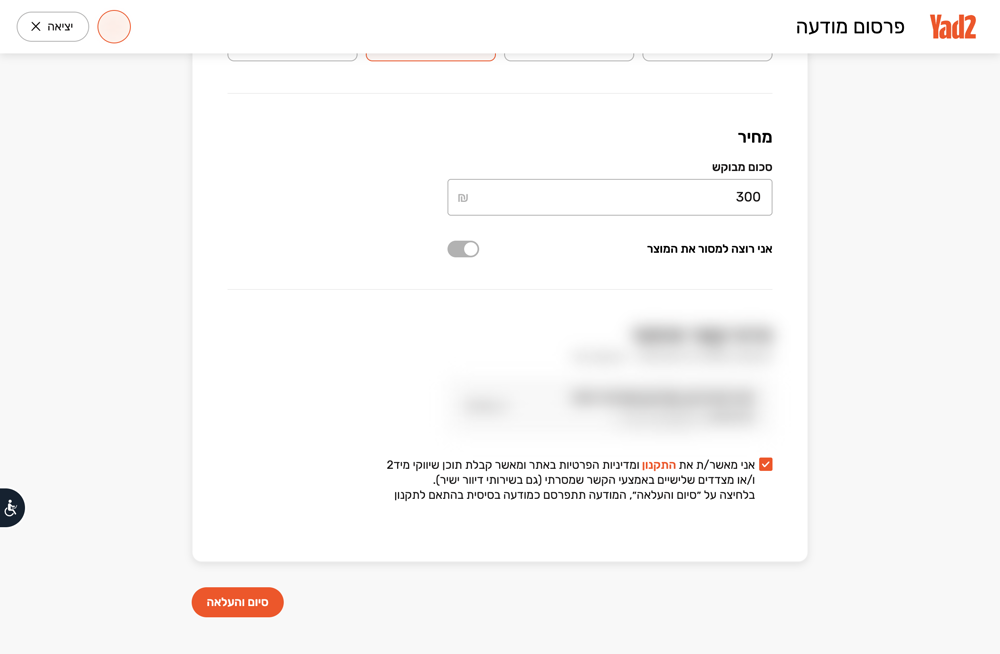

# Shark — UI walkthrough

Everything below was recorded against the **live sites** on Sep 24, 2026 from a clean checkout,
in dry-run / draft-only mode. Nothing was published. Personal details (name, phone, house number,
avatar) are blurred in the browser recordings.

## 1. Terminal: `doctor` → dry-run `sell`


[▶ MP4](media/shark-cli.mp4)

What you see:

1. `shark doctor` — Node, Playwright, config, Google Chrome, the shared **Shark Chrome** on
   `127.0.0.1:9333`, and which site tabs are already open (facebook.com, web.whatsapp.com,
   yad2.co.il).
2. `shark sell … --non-interactive` — all facts passed as flags, so no interview. Shark prints the
   **master listing**, the **per-platform differences**, the **DRY-RUN banner**, then drives the
   browser (off-screen) and reports one line per platform: `draft_ready`.

The final frame:


## 2. Browser: Yad2 publish form (`--draft-only`)


[▶ MP4](media/shark-yad2.mp4)

Order of operations on `yad2.co.il/publish-ad-products/create`:

| Step | Field                              | How Shark fills it                                                          |
| ---- | ---------------------------------- | --------------------------------------------------------------------------- |
| 1    | "Resume draft?" modal              | Always **התחלה מחדש** (start fresh) — no stale draft                        |
| 2    | Photos                             | Hidden `input[type=file]`, exact approved set, in order                     |
| 3    | כותרת (title)                      | `--title`                                                                   |
| 4    | סוג המוצר (type)                   | Autocomplete → `--yad2-type`, picked from the list                          |
| 5    | יצרן (brand)                       | Menu → `--yad2-brand`                                                       |
| 6    | תיאור (description)                | `--description`                                                             |
| 7    | מצב המוצר (condition)              | Toggle mapped from `--condition`                                            |
| 8    | מחיר (price)                       | `--price`                                                                   |
| 9    | פרטי קשר ואיסוף (contact & pickup) | Edit → city / street / house from `shark.config.json`                       |
| 10   | תקנון (terms)                      | Checkbox via its label                                                      |
| —    | **סיום והעלאה** (publish)          | **Not clicked** in draft-only. You press it, or Shark asks with `--publish` |

Final state, left open for review:



## 3. Facebook Marketplace and WhatsApp

Not recorded — the Marketplace composer renders your profile in a live preview, and a WhatsApp
send is a real message to a real person. Both adapters run the same way (`--platforms facebook`
or `whatsapp`, `--draft-only` for Facebook), and both were exercised end-to-end on Sep 19–24,
2026 (Marketplace + groups published, WhatsApp photo + caption sent to a self-chat). Flow:

- **Facebook**: `/marketplace/create/item` → photos → title, price → location → category dialog →
  condition → description ("More details" expanded if collapsed) → **Next** → destination step
  (Marketplace + `--groups`, Boost switched off) → **Publish** (only after your yes).
- **WhatsApp**: reuse the existing WhatsApp tab → sidebar search → exact chat name → Attach →
  "Photos & videos" → caption → **Send** (only after your yes, per chat).

## 4. Interrupted runs

If a site shows a CAPTCHA or asks to log in, Shark stops in the same tab and prints the run id:

```
Yad2       awaiting_human_captcha
Next action: Complete the Yad2 CAPTCHA in Shark Chrome, then run shark resume 32aa036d-….
```

`shark status <run-id>` shows the per-destination state; `shark resume <run-id>` continues from
the checkpoint. No automatic retry ever presses Publish or Send.

## Reproducing the recordings

- Terminal: `asciinema rec` of a real session, rendered to frames in headless Chromium (for
  correct Hebrew bidi) and assembled with ffmpeg.
- Browser: frames captured every 600 ms over CDP from the Shark Chrome tab during a real
  `--draft-only` run, with a blur applied to personal fields before each screenshot.
